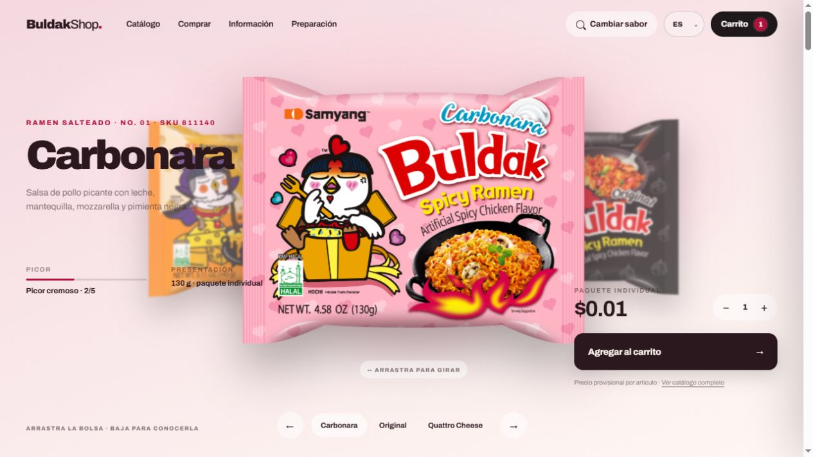

# BuldakShop

Tienda Flask conectada a Supabase y desplegada en Vercel.

## Vista en vivo

[](https://buldakshop.vercel.app/)

[](https://buldakshop.vercel.app/)

## Estructura

- `backend/`: API Flask, checkout demo y acceso a Supabase.
- `frontend/`: plantillas, estilos, JavaScript e imágenes.
- `supabase/migrations/`: esquema y datos iniciales del catálogo.

La raíz `app.py` es únicamente el punto de entrada WSGI de Vercel.

## Desarrollo local

```powershell
python -m venv .venv
.\.venv\Scripts\python -m pip install -r requirements.txt
.\.venv\Scripts\python app.py
```

Copia `.env.example` a un archivo local ignorado por Git y agrega las variables públicas de Supabase para usar la base remota durante el desarrollo. Sin esas variables, la aplicación usa el mismo catálogo incluido como respaldo local.
